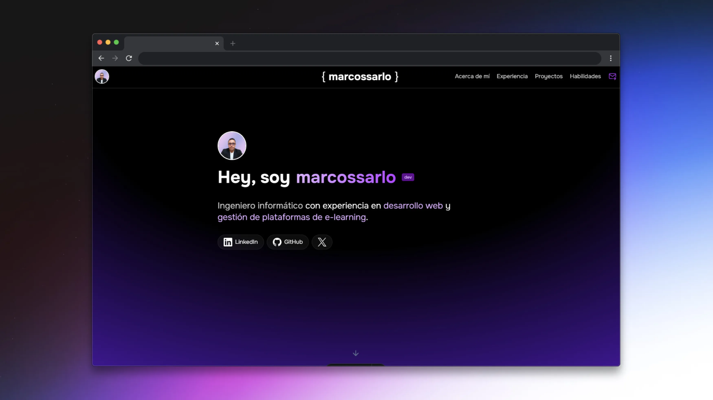

# MarcosSarLo - Portfolio Personal

Este es mi portfolio personal construido con **Astro** y **Tailwind CSS**. Un espacio donde muestro mi experiencia, proyectos y habilidades como desarrollador.



## 🚀 Tecnologías

- **Astro**: Framework web para sitios orientados al contenido.
- **Tailwind CSS**: Framework CSS de utilidad para el diseño.
- **Iconos**: Custom icons y componentes Astro.

## 📁 Estructura del Proyecto

Dentro de este proyecto Astro, encontrarás los siguientes archivos y carpetas:

```text
/
├── public/          # Activos estáticos
├── src
│   ├── assets/      # Imágenes y recursos locales
│   ├── components/  # Componentes Astro reutilizables
│   ├── layouts/     # Plantillas de página
│   └── pages/       # Rutas del sitio (.astro)
└── package.json
```

## 🧞 Comandos

Todos los comandos se ejecutan desde la raíz del proyecto, en una terminal:

| Comando                   | Acción                                           |
| :------------------------ | :----------------------------------------------- |
| `npm install`             | Instala las dependencias                         |
| `npm run dev`             | Inicia el servidor de desarrollo en `localhost:4321` |
| `npm run build`           | Construye el sitio para producción en `./dist/`  |
| `npm run preview`         | Previsualiza la construcción localmente          |
| `npm run astro ...`       | Ejecuta comandos de la CLI de Astro              |

## 👀 Want to learn more?

Feel free to check [our documentation](https://docs.astro.build) or jump into our [Discord server](https://astro.build/chat).
